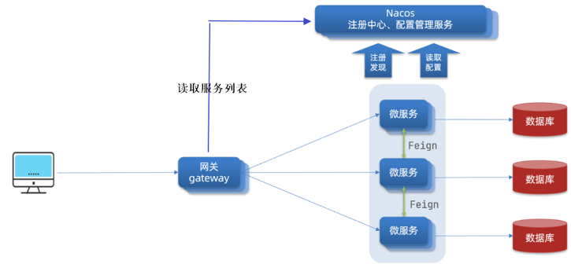
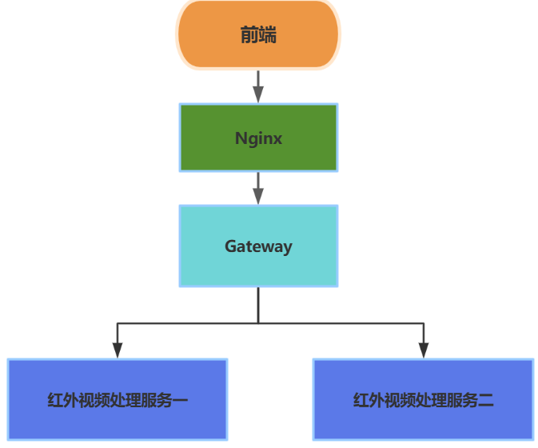
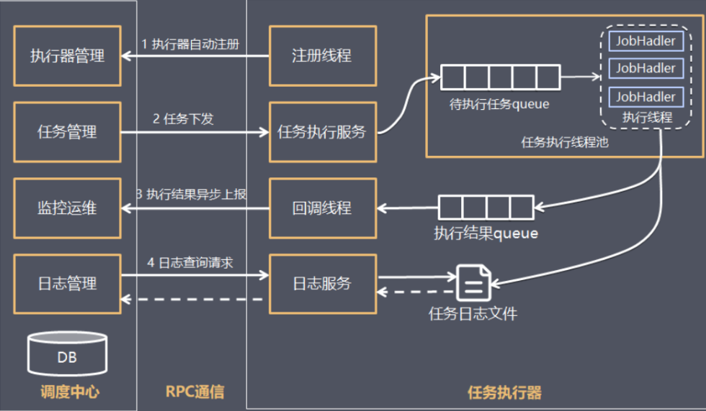
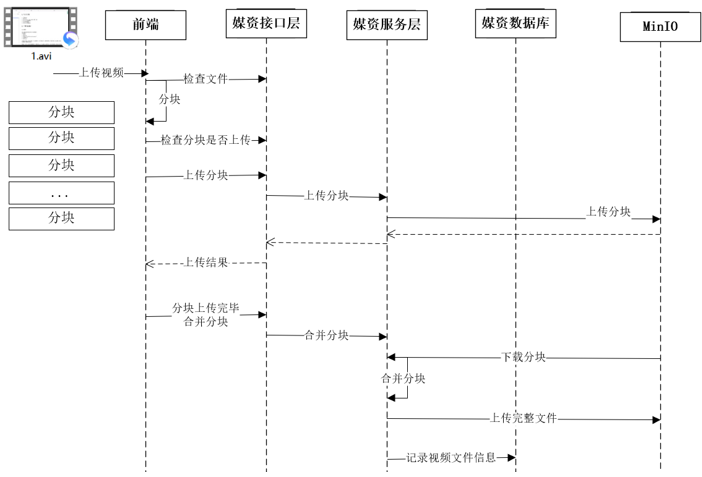
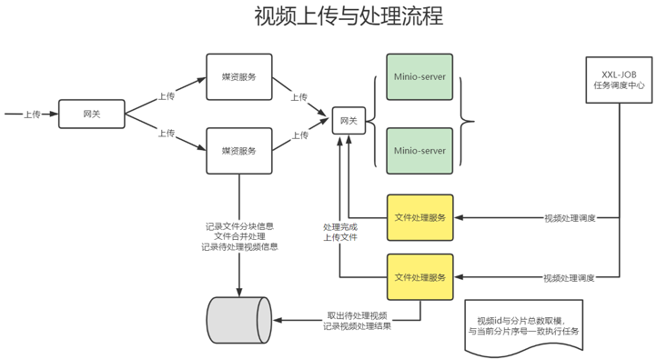
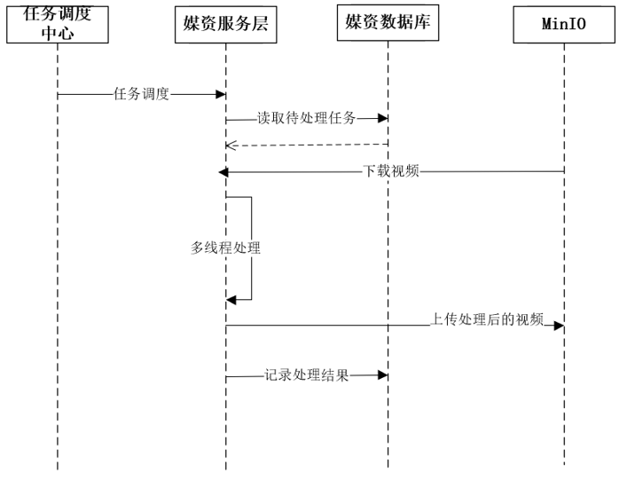

# irvProcess

#### 介绍
红外视频集中发布、处理、分析平台。一线技术人员将红外视频发布到平台后，平台会自动对视频进行算法增强处理。总部技术人员可远程接收处理后的红外视频，撰写并上传视频分析报告。

#### 软件架构
前后端分离，使用Spring Cloud Alibaba微服务框架，用到了Nacos、Spring Cloud Gateway、XXL-Job等分布式中间件，数据库用到了MySQL，Redis，视频存储用到了MinIO。

#### 组件工作流程

##### Nacos服务注册与配置中心

##### Gateway网关

##### XXL-Job分布式定时任务调度

##### 红外视频分片上传流程

##### 红外视频上传后处理流程

##### XXL-JOB调度数据库中未处理视频进行处理流程

#### 项目心得

1.  完成了红外视频分片上传，断点续传的核心后端服务接口。
2.  使用XXL-Job定时任务组件完成了红外视频的异步化转码处理功能。
3.  熟悉了MinIO分布式存储组件的使用与工作流程。
4.  在项目中熟悉了Spring Cloud Alibaba框架的使用，对其中各项分布式组件的工作流程有了深入了解。

#### 项目未来工作

1.  将本人之前编写的红外视频处理算法陆续集成到项目中。
2.  完善项目后端的用户管理服务。
3.  学习搭建对应的前端项目，最终使得该B端项目上线运行。
4.  引入自然语言大模型，利用AI对红外视频处理后的数据进行分析，得到可视化的图表数据以及结论。